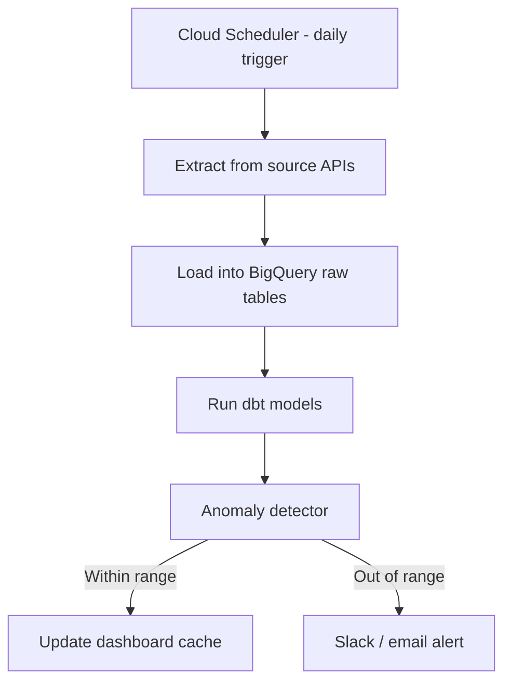

# Automated Reporting Pipeline

Scheduled data refresh with built in anomaly detection, so issues get caught the day they happen instead of at the end of the month when someone finally opens the dashboard.

## The problem this solves

A dashboard is only useful if the data behind it is fresh and someone actually looks at it when something breaks. This pipeline handles both, refreshing the warehouse on a schedule and pushing an alert to Slack the moment a metric moves outside its normal range.

## Architecture

## What's in here

* `scripts/daily_refresh.py` orchestrates the extract, load, and dbt run steps in order
* `scripts/anomaly_detector.py` compares each day's key metrics against a trailing average and flags anything outside a configurable threshold
* `config/alert_rules.yaml` defines which metrics are watched and how sensitive the anomaly threshold is per metric

## How it's used in practice

The refresh runs early each morning so the dashboard is current before anyone opens it. The anomaly detector isn't a fixed threshold, it compares against a rolling seven day average per metric, since a 20% spend increase means something different for a channel that normally moves 5% a day versus one that's usually flat. When something trips the threshold, the alert goes to Slack with the metric, the expected range, and the actual value, so whoever's on call doesn't have to go digging to understand what happened.

## Stack

Python, BigQuery, dbt, Cloud Scheduler, Slack API
