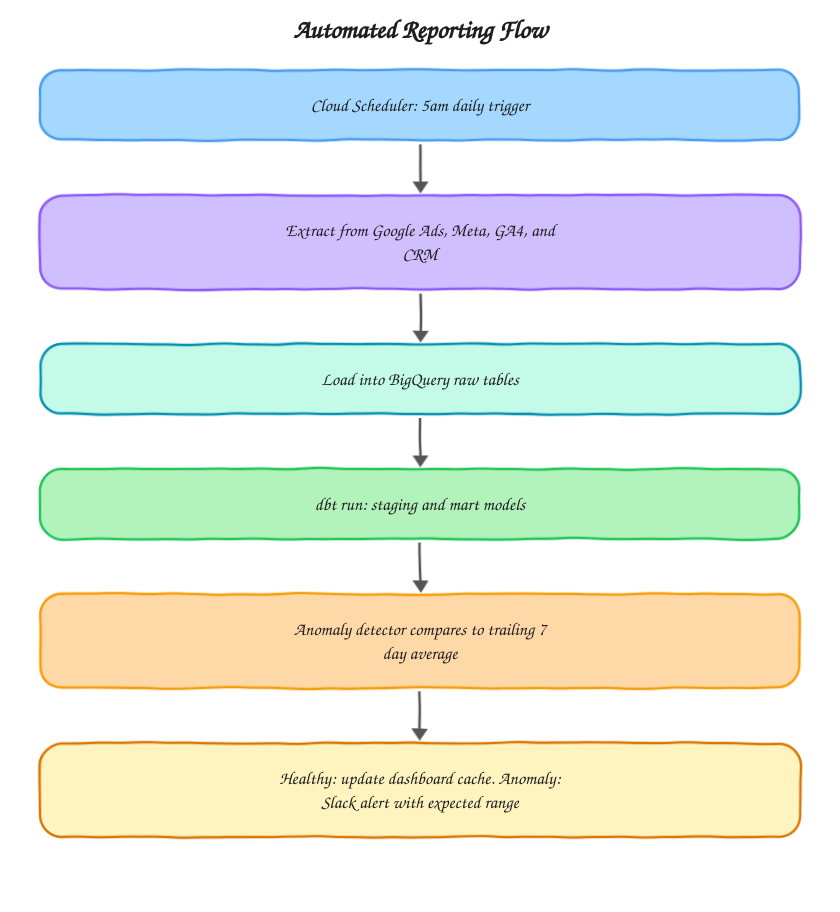

# Automated Reporting Pipeline

Scheduled data refresh with built in anomaly detection, so issues get caught the day they happen instead of at the end of the month when someone finally opens the dashboard.

## The problem this solves

A dashboard is only useful if the data behind it is fresh and someone actually looks at it when something breaks. Most teams have neither: refreshes happen manually and irregularly, and nobody's watching the numbers closely enough to notice a tracking break or a spend spike until it's already cost real money. This pipeline handles both halves of that problem, refreshing the warehouse on a fixed schedule and pushing an alert the moment a watched metric moves outside its expected range.

## Architecture

The anomaly detector step is deliberately positioned after the dbt run, not before, so it's always evaluating modeled, business-logic-applied metrics like blended ROAS rather than raw, unjoined numbers that would produce noisy false positives.

## What's in here

* `scripts/daily_refresh.py` orchestrates the extract, load, and dbt run steps in order, with per-source error handling so one failed extractor doesn't silently take down the rest
* `scripts/anomaly_detector.py` compares each day's key metrics against a trailing 7 day average and flags anything outside a configurable threshold
* `config/alert_rules.yaml` defines which metrics are watched and how sensitive the anomaly threshold is per metric

## How it's used in practice

The refresh runs early each morning so the dashboard is current before anyone opens it. The anomaly detector isn't a fixed threshold, it compares against a rolling seven day average per metric, since a 20% spend increase means something different for a channel that normally moves 5% a day versus one that's usually flat. Thresholds are set per metric in `alert_rules.yaml` rather than globally, because a metric like session count naturally has more day to day noise than something like blended ROAS. When something trips the threshold, the alert goes to Slack with the metric name, the expected range, and the actual value, so whoever's on call doesn't have to go digging to understand what happened before deciding whether it's real.

## Tuning the thresholds

Start conservative (25-35%) and tighten over the first few weeks once you have a sense of the metric's normal day to day variance. A threshold that's too tight produces alert fatigue, which is worse than missing a real anomaly, since it trains whoever's on call to ignore the channel.

## Setup

1. Deploy `daily_refresh.py` as a Cloud Function or Cloud Run job
2. Configure Cloud Scheduler to trigger it daily at the desired time
3. Set up a Slack incoming webhook and add the URL to `anomaly_detector.py`
4. Adjust `config/alert_rules.yaml` to match the metrics and thresholds relevant to the client

## Stack

Python, BigQuery, dbt, Cloud Scheduler, Slack API
